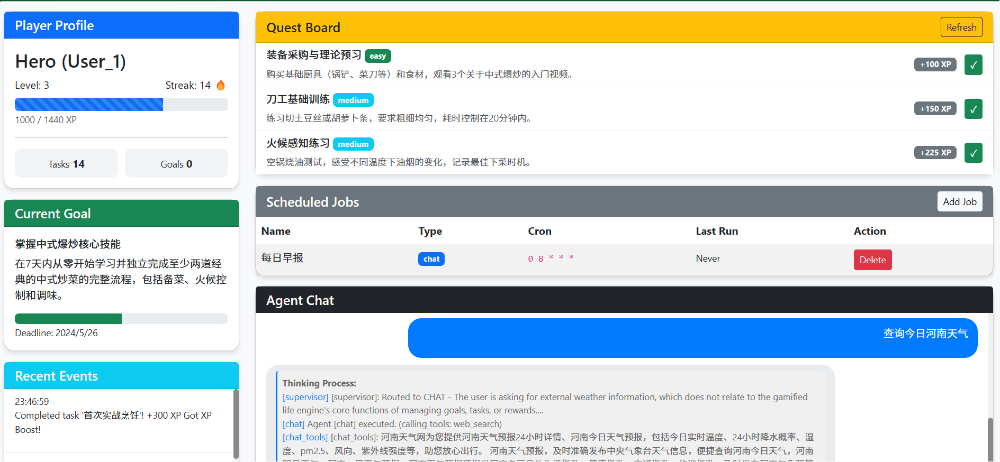
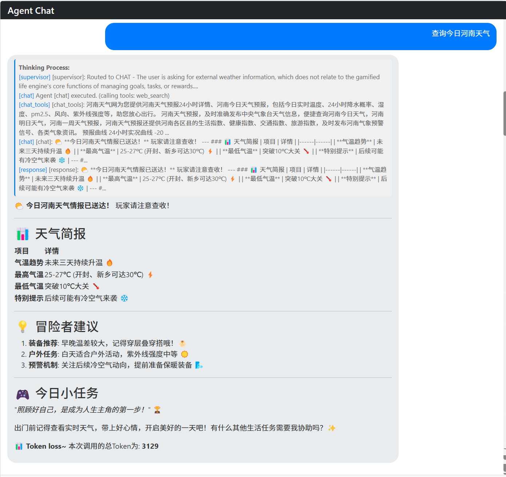

# Gamified Life-Agent Engine

基于多智能体与 MCP 协议的"游戏化"目标管理引擎

## 项目简介

这是一个由 AI 驱动的复杂状态机和动态规则引擎。它将用户的日常任务转化为带有随机奖励、挑战和触发机制的"主线/支线任务"。

### 核心特性

- **多智能体编排 (Multi-Agent Orchestration)**: 使用 LangGraph 实现 Supervisor、Planner、Reward、Query、Chat、Reflector 协作
- **工作流闭环**: 主链路为 `supervisor -> {planner|reward|query|chat} -> response -> reflector -> END`
- **游戏化机制**: XP 经验值系统、随机掉落、成就系统、连续签到
- **MySQL 持久化存储**: 用户状态、任务、目标、成就、奖励全量存储
- **MCP 外部工具集成**: 支持读取本地日历、待办事项、GitHub 提交等
- **定时任务调度**: 支持 APScheduler 驱动的 `chat`/`reflector` 定时执行
- **Flask 后端服务**: 高性能 Python Web 框架

## 技术栈

| 技术 | 用途 |
|------|------|
| **LangGraph** | Agent 编排框架 |
| **Flask** | Web 后端框架 |
| **SQLAlchemy** | ORM 数据库操作 |
| **MySQL** | 主数据库 |
| **LiteLLM** | LLM 统一封装 |
| **MCP** | 外部工具协议 |

## 快速开始

### 1. 环境要求

- Python 3.10+
- MySQL 8.0+
- Redis (可选)

### 2. 安装依赖

```bash
pip install -r requirements.txt
```

### 3. 配置环境变量

```bash
cp .env.example .env
```

编辑 `.env` 文件，配置以下内容：

```env
# MySQL
MYSQL_HOST=localhost
MYSQL_PORT=3306
MYSQL_USER=root
MYSQL_PASSWORD=your-password
MYSQL_DB=gamified_life

# LLM (LiteLLM)
LITELLM_API_KEY=your-api-key-here
DEFAULT_MODEL=gpt-4
```

### 4. 创建数据库

```sql
CREATE DATABASE gamified_life CHARACTER SET utf8mb4 COLLATE utf8mb4_unicode_ci;
```

### 5. 启动服务

```bash
python -m app.main
```

服务将在 `http://localhost:5000` 启动。

### 6. 启动 MCP 工具服务（可选但推荐）

```bash
python -m app.mcp.server
```

默认地址为 `http://localhost:8001`。

## API 接口

### 基础接口

| 方法 | 路径 | 描述 |
|------|------|------|
| GET | `/` | 服务信息 |
| GET | `/api/status` | 服务与 Agent 状态 |
| GET | `/health` | 健康检查 |

### 用户接口

| 方法 | 路径 | 描述 |
|------|------|------|
| POST | `/api/chat` | 与 Agent 对话 |
| GET | `/api/profile/<user_id>` | 获取用户资料 |
| GET | `/api/goals/<user_id>` | 获取用户目标 |
| GET | `/api/tasks/<user_id>` | 获取用户任务 |
| GET | `/api/events/<user_id>` | 获取游戏事件 |

### 任务接口

| 方法 | 路径 | 描述 |
|------|------|------|
| POST | `/api/tasks/complete/<task_id>` | 完成任务 |

### 数据接口

| 方法 | 路径 | 描述 |
|------|------|------|
| GET | `/api/achievements` | 获取所有成就 |
| GET | `/api/rewards` | 获取所有奖励 |

### 定时任务接口

| 方法 | 路径 | 描述 |
|------|------|------|
| POST | `/api/schedules` | 创建定时任务（`chat`/`reflector`） |
| GET | `/api/schedules/<user_id>` | 获取用户定时任务 |
| DELETE | `/api/schedules/<job_id>` | 删除定时任务 |

## API 使用示例

### 1. 创建用户/发送消息

```bash
curl -X POST http://localhost:5000/api/chat \
  -H "Content-Type: application/json" \
  -d '{
    "user_id": "user-123",
    "message": "这周我要搞定遥感论文的初稿，还要健身三次"
  }'
```

响应示例：

```json
{
  "success": true,
  "agent": "PLANNING",
  "message": "已为您创建目标「遥感论文初稿」和3个每日任务...",
  "data": {
    "goal": {
      "id": "xxx",
      "title": "遥感论文初稿",
      "xp_reward": 450
    },
    "tasks": [
      {
        "id": "xxx",
        "title": "完成文献综述",
        "difficulty": "medium",
        "xp_reward": 150
      }
    ],
    "profile": {
      "level": 1,
      "total_xp": 0,
      "streak_days": 0
    }
  }
}
```

### 2. 完成任务

```bash
curl -X POST http://localhost:5000/api/tasks/complete/task-xxx \
  -H "Content-Type: application/json" \
  -d '{"user_id": "user-123"}'
```

响应示例：

```json
{
  "success": true,
  "message": "Completed task '完成文献综述'! +150 XP",
  "xp_earned": 150,
  "level_up": false,
  "new_level": 1,
  "drop": {
    "name": "XP Boost",
    "rarity": "common"
  },
  "profile": {
    "level": 1,
    "total_xp": 150,
    "tasks_completed": 1
  }
}
```

### 3. 获取用户资料

```bash
curl http://localhost:5000/api/profile/user-123
```

## 游戏机制

### 任务难度与 XP

| 难度 | XP 倍数 | 掉落率加成 |
|------|---------|-----------|
| Easy | 1.0x | - |
| Medium | 1.5x | - |
| Hard | 2.0x | +5% |
| Epic | 3.0x | +15% |

### 随机掉落

- **Common** (常见): 60% 概率
- **Rare** (稀有): 25% 概率
- **Epic** (史诗): 12% 概率
- **Legendary** (传说): 3% 概率

### 成就系统

| 成就 | 条件 |
|------|------|
| ⚔️ First Blood | 完成第一个任务 |
| 🔥 On Fire | 3 天连续签到 |
| 💎 Unstoppable | 7 天连续签到 |
| 📋 Master Planner | 完成 10 个任务 |
| 🎯 Goal Crusher | 完成 5 个目标 |
| 🏆 Challenge Seeker | 完成 10 个挑战 |
| 👑 Epic Hero | 完成一个 Epic 任务 |
| ⭐ Rising Star | 达到 10 级 |
| 🌟 Veteran | 达到 50 级 |
| ⚡ Streak Master | 30 天连续签到 |

## 项目结构

```
GamifiedLife/
├── requirements.txt         # 依赖
├── .env.example             # 环境变量模板
└── app/
    ├── config.py            # 配置
    ├── schemas.py           # 数据模型
    ├── main.py              # Flask 主应用
    ├── scheduler_service.py # APScheduler 调度服务
    ├── agents/              # 智能体模块
    │   ├── state.py         # LangGraph 状态
    │   ├── llm_client.py    # LLM 客户端
    │   ├── supervisor.py   # 意图路由
    │   ├── planner.py       # 目标规划
    │   ├── reward.py        # 奖励系统
    │   ├── query.py         # 查询
    │   ├── chat.py          # 通用聊天
    │   ├── reflector.py     # 用户画像反思
    │   └── workflow.py      # 工作流
    ├── database/            # 数据层
    │   ├── models.py        # SQLAlchemy 模型
    │   └── services.py      # Agent 结果持久化
    └── mcp/                 # MCP 协议
        ├── server.py        # MCP 服务
        ├── client.py        # MCP 客户端
        └── mcp_tools.py     # LangChain 工具包装
```

## 扩展开发

### 添加新的 Agent

1. 在 `app/agents/` 目录创建新的 Agent 文件
2. 实现 Agent Node 函数
3. 在 `workflow.py` 中注册到 LangGraph

# 计划
- [ ] 设计用户属性经验条
- [x] agent链路流输出
- [ ] 添加更多MCP工具
  - [ ] 日历工具
  - [x] 网络搜索工具
  - [ ] GitHub 提交工具
  - [ ] 获取位置 工具 
- [ ] 实现自定义奖励（通过chat触发工具并加入奖池）
  - [ ] 设计奖励生成工具（输入用户状态，输出奖励建议，根据用户行为和目标）
  - [ ] 将奖励生成工具集成到 Planner 或 Reward Agent 中
- [x] 实现 OpenTelemetry全链路监控
- [ ] 加入Redis 以及 ES 以支持更复杂的状态管理和搜索功能

# 展示


## License

MIT License
